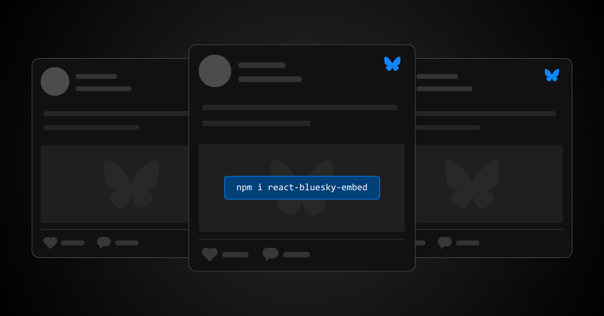

# React Bluesky Embed

React Bluesky Embed allows you to embed post threads, profiles, and comments in your React application when using Next.js, Create React App, Vite, and more.

Profiles and comments support coming soon.

Adapters for Solid, Vue, Angular, and Svelte are coming soon.



## Documentation

For documentation visit [react-bluesky-embed.vercel.app](https://react-bluesky-embed.vercel.app).

## Installation

```sh
npm i react-bluesky-embed
```

## Usage

```tsx
<PostThread
  params={{
    did: "did:plc:gru662w3omynujkgwebgeeof",
    rkey: "3lbirib5xnc2u",
  }}
  theme="dark"
  // set the depth to 1+ to show replies
  config={{
    depth: 6,
  }}
  // only show the replies
  hidePost={false}
/>
```

## Contributing

Visit our [contributing docs](https://react-bluesky-embed.vercel.app/contributing).
